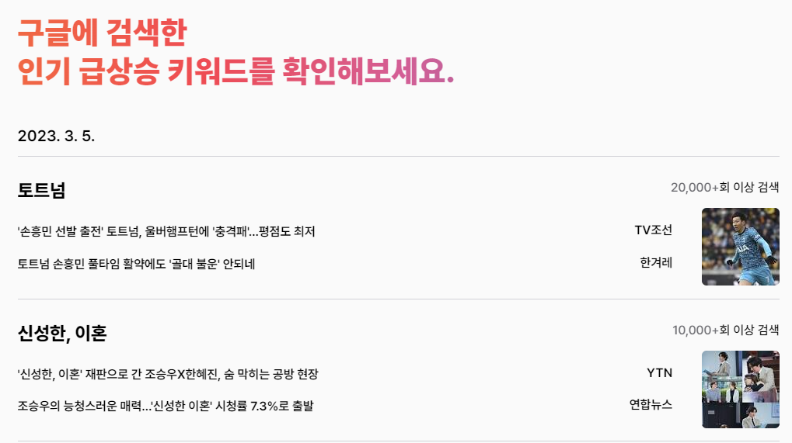
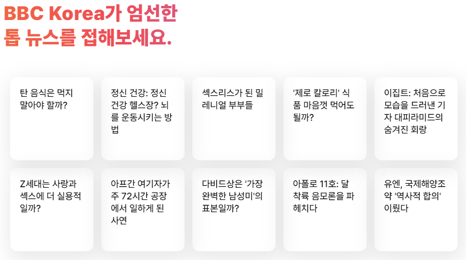
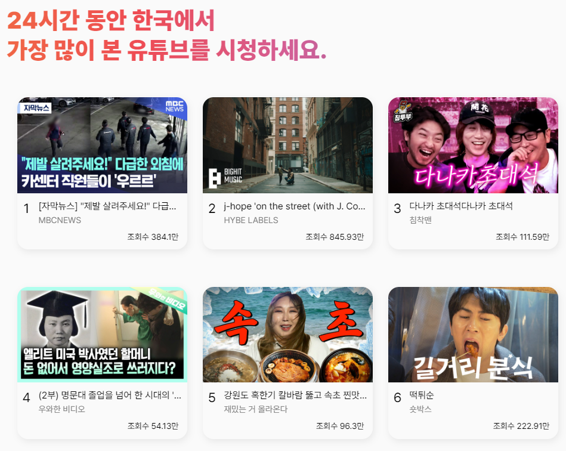
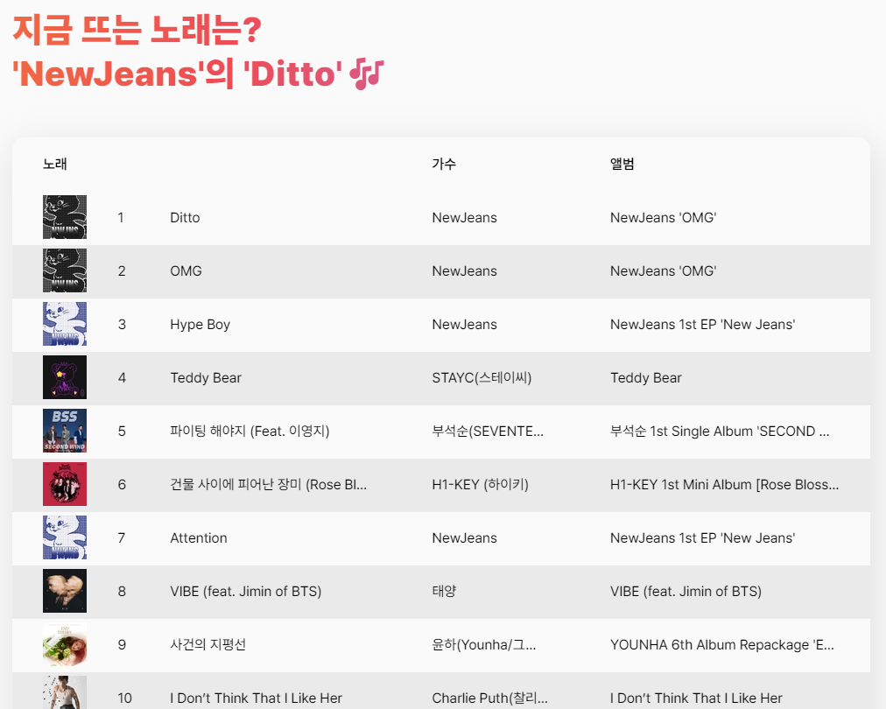
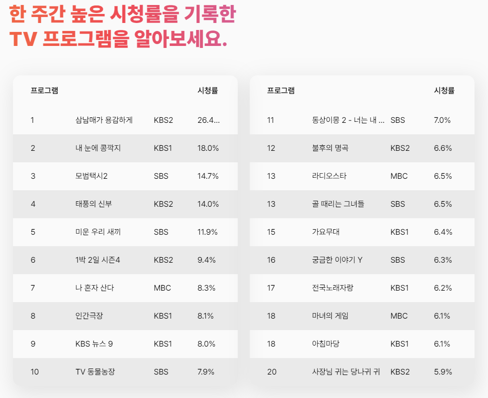
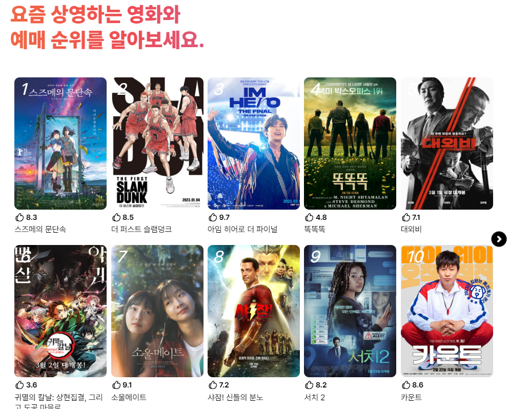

# Trendz

요즘 트렌트를 따라가기 벅찰 때, 스몰토크 주제로 무슨 말을 해야 할지 모를 때. 그럴때 요즘 트렌트가 무엇인지 빠르게 알 수 있는 사이트를 만들고 싶었습니다. Trendz는 요즘 트랜드를 한페이지 안에 빠르게 훑어 볼 수 있는 사이트입니다. 그로인해 당신의 인싸력을 향상시키는 것을 목표로 합니다.🙂   

# 🤳스크린샷

  

# 🛠 기술 스택

 
<h2 align="left">Client</h2> 
  
  
  
  
  
  
  
 
<h2 align="left">Server</h2> 
  
  
  
  
   

